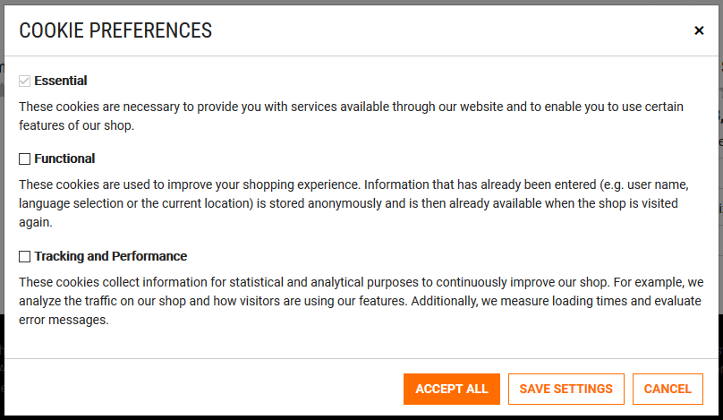
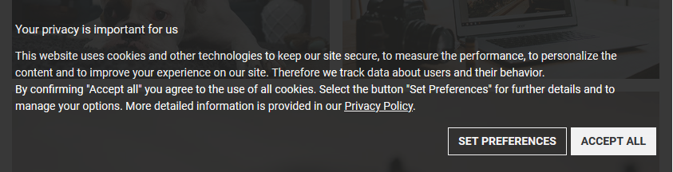

<!--
kb_guide
kb_pwa
kb_everyone
kb_sync_latest_only
-->

# Cookie Consent

The Intershop PWA contains an own cookie consent implementation that provides means to configure the different options a shop user should be presented with when deciding which types of cookies the user wants to allow and which not.
Based on this decision a cookie is written that saves the users cookie consent settings.
These settings can then be used to activate or deactivate certain functionalities that rely on cookies or other means of collecting user data.

## Configure Cookie Consent Options

The configuration of the cookie consent functionality is done via the application environments configuration of the project.
A default is set in the `ENVIRONMENT_DEFAULTS` in the `environment.model.ts`.

```javascript
cookieConsentOptions: {
  options: [
    {
      id: 'required',
      name: 'cookie.consent.option.required.name',
      description: 'cookie.consent.option.required.description',
      required: true,
    },
    {
      id: 'functional',
      name: 'cookie.consent.option.functional.name',
      description: 'cookie.consent.option.functional.description',
    },
    {
      id: 'tracking',
      name: 'cookie.consent.option.tracking.name',
      description: 'cookie.consent.option.tracking.description',
    },
  ],
  allowedCookies: ['cookieConsent', 'apiToken'],
},
```

The `options` array configures the presented options in the Cookie Preferences modal.

- The option `id` is the value that will be saved in the users `cookieConsent` settings.
- The `name` makes up the checkbox label name, usually given as localization key.
- The `description` contains the additional option description, usually given as localization key.
- With the `required` flag an option can be marked as not de-selectable.
  This can be used to signal the user that required cookies will always be set without explicit consent of the user.

The following screenshot is the rendered representation of the default cookie consent options configuration.


With the `allowedCookies` configuration a list of required cookies can be identified that will not be controlled by cookie consent settings and will not be deleted during cookie preferences changes.
All other cookies will be deleted if the user changes the settings.
The enabled options cookies would be written new if needed.
The `cookieConsent` cookie always needs to be set as allowed cookie.

## Control Cookie Consent Banner Display

To request the users cookie consent and to inform the user about the usage of cookies in the application a banner is presented at the bottom of the screen.



This banner will be displayed if the user has not yet accepted any of the cookie options meaning the user does not have the `cookieConsent` cookie set in his browser.

Once the user confirms the cookie consent the cookie is set and the application will reload with the new cookie preferences set and without presenting the cookie banner again.
Once the cookie is expired the cookie banner will be presented again.

When setting the `cookieConsent` cookie in addition to the selected options the currently configured cookie consent `version` is saved as well in the cookie.
With this version flag it is possible to force the presentation of the cookie consent banner again for users that have given their consent earlier for a lower cookie consent version number.
This might be necessary if the linked Privacy Policy was updated or if additional or changed cookie consent options need to be presented and accepted.

The cookie consent version can be set in two ways.
Either by changing the application environments configuration default `cookieConsentVersion` value in the `ENVIRONMENT_DEFAULTS` in the `environment.model.ts` or setting a different value in any specific `environment.ts` via source code changes.

```json
cookieConsentVersion: 1,
```

The second option to set the cookie consent version is via the environment variable `COOKIE_CONSENT_VERSION` of the deployment.
For running a PWA Docker container with a specifically set cookie consent version this could look like this.

```
docker run -d -p <port>:4200 -e COOKIE_CONSENT_VERSION=3 --name <container_name> <pwa_image_name>
```

This way a re-required cookie consent banner display can be controlled independent from the PWA source code just with a deployment setting.

## Cookie Consent Settings

The users accepted cookie consent settings are saved to an required and allowed cookie named `cookieConsent`.
The default expiration time of this cookie is one year.
It's value contains the enabled cookie consent options and the cookie consent version that was accepted as an encoded JSON object.

```json
{ "enabledOptions": ["required", "functional", "tracking"], "version": "1" }
```

## Enable PWA Functionality Dependent on Cookie Consent Settings

To enable certain functionalities based on a given cookie consent of the user, e.g. because they require setting specific cookies or collect user data, the PWAs `CookiesService` provides a method `cookieConsentFor()` to check for the required cookie consent.

Example for cookie consent check:

```javascript
if (cookiesService.cookieConsentFor('tracking')) {
  ...
}
```

In the standard Intershop PWA implementation an enabled `tracking` option for the cookie consent is currently needed to start the [Google Tag Manager](https://support.google.com/tagmanager) integration and the [Sentry](https://sentry.io) application monitoring and error tracking if these features are enabled in the deployment.

## Displaying the Cookie Consent Options

To display the cookie consent options of the shop and the current settings of the current user a special `/cookies` route is implemented in the PWA that will open the cookie preferences modal.
This route can be linked to from anywhere within the application.
